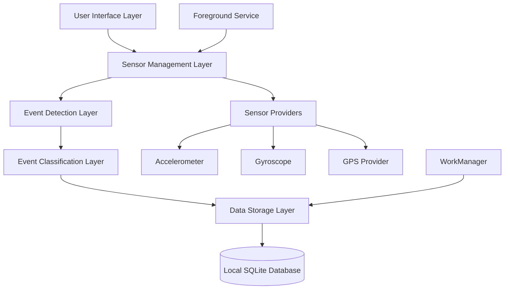

# Design Document: Sensor Data Collection

## Overview

The Sensor Data Collection feature implements a robust, battery-efficient system for detecting road surface anomalies using Android device sensors. The system operates continuously in the background, processing accelerometer, gyroscope, and GPS data to identify and classify road events such as potholes and bumps. The architecture prioritizes minimal battery consumption, high data quality, and reliable background operation while adhering to Android's background processing restrictions.

## Architecture

The system follows a layered architecture with clear separation of concerns:



### Key Architectural Decisions

1. **Foreground Service**: Continuous sensor monitoring requires a foreground service to maintain sensor listeners during background operation and prevent system termination
2. **Event-Driven Processing**: Sensor data is processed in real-time using threshold-based detection to minimize memory usage and processing overhead
3. **Local-First Storage**: All events are stored locally first, with synchronization handled separately to ensure data persistence during network outages
4. **Adaptive Sampling**: Dynamic sampling rate adjustment based on motion detection and battery level to optimize power consumption

## Components and Interfaces

### 1. SensorMonitorService (Foreground Service)

**Responsibilities:**
- Manage sensor listeners lifecycle
- Coordinate between sensor providers
- Handle session management
- Implement battery optimization strategies

**Key Methods:**
```kotlin
interface SensorMonitorService {
    fun startMonitoring(): Boolean
    fun stopMonitoring()
    fun pauseMonitoring()
    fun resumeMonitoring()
    fun getCurrentSession(): UUID?
    fun adjustSamplingRate(rate: SensorRate)
}
```

### 2. SensorDataProcessor

**Responsibilities:**
- Process raw sensor data streams
- Apply filtering and noise reduction
- Coordinate multi-sensor data fusion

**Key Methods:**
```kotlin
interface SensorDataProcessor {
    fun processSensorData(data: SensorData): ProcessedData
    fun calibrateSensors(): Boolean
    fun isDeviceInVehicle(): Boolean
    fun detectMotionState(): MotionState
}
```

### 3. EventDetector

**Responsibilities:**
- Identify potential road anomaly events
- Apply threshold-based detection algorithms
- Filter false positives

**Key Methods:**
```kotlin
interface EventDetector {
    fun detectEvent(processedData: ProcessedData): DetectedEvent?
    fun validateEvent(event: DetectedEvent): Boolean
    fun mergeConsecutiveEvents(events: List<DetectedEvent>): DetectedEvent
}
```

### 4. EventClassifier

**Responsibilities:**
- Assign severity levels to detected events
- Calculate confidence scores
- Apply classification algorithms

**Key Methods:**
```kotlin
interface EventClassifier {
    fun classifyEvent(event: DetectedEvent): ClassifiedEvent
    fun calculateSeverity(peakAcceleration: Float): Int
    fun calculateConfidence(event: DetectedEvent, gpsAccuracy: Float): Float
}
```

### 5. LocationProvider

**Responsibilities:**
- Manage GPS location services
- Provide location context for events
- Handle location permission and availability

**Key Methods:**
```kotlin
interface LocationProvider {
    fun getCurrentLocation(): Location?
    fun isLocationAvailable(): Boolean
    fun getLocationAccuracy(): Float
    fun startLocationUpdates()
    fun stopLocationUpdates()
}
```

### 6. EventRepository

**Responsibilities:**
- Persist events to local database
- Manage data lifecycle and cleanup
- Provide data access interface

**Key Methods:**
```kotlin
interface EventRepository {
    suspend fun saveEvent(event: RoadAnomalyEvent): Long
    suspend fun getUnsynced Events(): List<RoadAnomalyEvent>
    suspend fun markEventSynced(eventId: UUID)
    suspend fun cleanupOldEvents(retentionDays: Int)
    suspend fun getEventsBySession(sessionId: UUID): List<RoadAnomalyEvent>
}
```

## Data Models

### RoadAnomalyEvent
```kotlin
data class RoadAnomalyEvent(
    val id: UUID = UUID.randomUUID(),
    val createdAt: Instant,
    val latitude: Double,
    val longitude: Double,
    val gpsAccuracyM: Float,
    val speedKmh: Float,
    val headingDeg: Float?,
    val peakAccelMs2: Float,
    val impulseDurationMs: Int,
    val severity: Int, // 1-5
    val confidence: Float, // 0.0-1.0
    val deviceModel: String,
    val androidVersion: String,
    val sessionId: UUID,
    val synced: Boolean = false
)
```

### SensorData
```kotlin
data class SensorData(
    val timestamp: Long,
    val accelerometer: AccelerometerData,
    val gyroscope: GyroscopeData,
    val location: LocationData?
)

data class AccelerometerData(
    val x: Float,
    val y: Float,
    val z: Float,
    val accuracy: Int
)

data class GyroscopeData(
    val x: Float,
    val y: Float,
    val z: Float,
    val accuracy: Int
)

data class LocationData(
    val latitude: Double,
    val longitude: Double,
    val accuracy: Float,
    val speed: Float,
    val bearing: Float,
    val timestamp: Long
)
```

### DetectedEvent
```kotlin
data class DetectedEvent(
    val timestamp: Long,
    val peakAcceleration: Float,
    val duration: Int,
    val location: LocationData?,
    val sensorQuality: SensorQuality
)

data class SensorQuality(
    val accelerometerAccuracy: Int,
    val gyroscopeAccuracy: Int,
    val gpsAccuracy: Float,
    val deviceStability: Float
)
```

## Detection Algorithm

### Threshold-Based Detection
Based on research findings, the system implements a multi-stage detection algorithm:

1. **Primary Threshold**: Vertical acceleration > 2.5 m/s² triggers initial detection
2. **Duration Analysis**: Events lasting 50-500ms are considered valid road anomalies
3. **Consecutive Event Merging**: Events within 500ms are merged into single anomaly
4. **Speed Filtering**: Events at speeds < 5 km/h are discarded as false positives

### Severity Classification
```kotlin
fun calculateSeverity(peakAcceleration: Float): Int {
    return when {
        peakAcceleration < 4.0f -> 1  // Minor bump
        peakAcceleration < 6.0f -> 2  // Moderate bump
        peakAcceleration < 8.0f -> 3  // Significant pothole
        peakAcceleration < 12.0f -> 4 // Major pothole
        else -> 5                     // Severe road damage
    }
}
```

### Confidence Calculation
```kotlin
fun calculateConfidence(event: DetectedEvent, gpsAccuracy: Float): Float {
    val gpsScore = when {
        gpsAccuracy <= 5f -> 1.0f
        gpsAccuracy <= 10f -> 0.8f
        gpsAccuracy <= 20f -> 0.6f
        else -> 0.3f
    }
    
    val sensorScore = (event.sensorQuality.accelerometerAccuracy + 
                      event.sensorQuality.gyroscopeAccuracy) / 6.0f
    
    val stabilityScore = event.sensorQuality.deviceStability
    
    return (gpsScore * 0.4f + sensorScore * 0.3f + stabilityScore * 0.3f)
        .coerceIn(0.0f, 1.0f)
}
```

## Background Processing Strategy

### Foreground Service Implementation
- **Service Type**: `FOREGROUND_SERVICE_TYPE_LOCATION` for continuous GPS access
- **Notification**: Persistent notification showing collection status
- **Lifecycle Management**: Service starts/stops based on user preferences and battery level

### Battery Optimization
1. **Adaptive Sampling**: 50Hz during active driving, 10Hz during stationary periods
2. **Motion Detection**: Use accelerometer variance to detect vehicle movement
3. **GPS Optimization**: Reduce location update frequency when stationary
4. **Automatic Pause**: Stop collection when battery < 15%

### Android Background Restrictions Compliance
- Use foreground service for continuous operation
- Request battery optimization exemption
- Implement proper service lifecycle management
- Handle doze mode and app standby gracefully

## Data Storage Strategy

### Local SQLite Database
```sql
CREATE TABLE road_anomaly_events (
    id TEXT PRIMARY KEY,
    created_at INTEGER NOT NULL,
    latitude REAL NOT NULL,
    longitude REAL NOT NULL,
    gps_accuracy_m REAL NOT NULL,
    speed_kmh REAL NOT NULL,
    heading_deg REAL,
    peak_accel_ms2 REAL NOT NULL,
    impulse_duration_ms INTEGER NOT NULL,
    severity INTEGER NOT NULL,
    confidence REAL NOT NULL,
    device_model TEXT NOT NULL,
    android_version TEXT NOT NULL,
    session_id TEXT NOT NULL,
    synced INTEGER DEFAULT 0
);

CREATE INDEX idx_session_id ON road_anomaly_events(session_id);
CREATE INDEX idx_synced ON road_anomaly_events(synced);
CREATE INDEX idx_created_at ON road_anomaly_events(created_at);
```

### Data Lifecycle Management
- **Retention Policy**: Keep synced events for 30 days, unsynced indefinitely
- **Storage Limits**: Maximum 10,000 events, cleanup oldest synced events when limit reached
- **Backup Strategy**: Export capability for manual data backup

Now I need to use the prework tool to analyze the acceptance criteria before writing the correctness properties.
## Correctness Properties

*A property is a characteristic or behavior that should hold true across all valid executions of a system—essentially, a formal statement about what the system should do. Properties serve as the bridge between human-readable specifications and machine-verifiable correctness guarantees.*

### Property 1: Sensor Sampling Rate Compliance
*For any* active sensor monitoring session, both accelerometer and gyroscope sampling rates should maintain at least 50Hz throughout the session.
**Validates: Requirements 1.1, 1.2**

### Property 2: GPS Update Frequency
*For any* active GPS tracking session, location updates should occur with intervals not exceeding 5 seconds.
**Validates: Requirements 1.3**

### Property 3: Autonomous Operation Continuity
*For any* device in motion state, sensor data collection should continue without requiring user intervention.
**Validates: Requirements 1.4**

### Property 4: Background Operation Persistence
*For any* system with battery optimization enabled, the sensor monitor should maintain background operation.
**Validates: Requirements 1.5**

### Property 5: Acceleration Threshold Detection
*For any* sensor data stream, vertical acceleration values exceeding 2.5 m/s² should be identified as potential road anomalies, while values below should not trigger detection.
**Validates: Requirements 2.1**

### Property 6: Peak Acceleration Measurement Accuracy
*For any* detected acceleration event, the measured peak acceleration value should accurately reflect the maximum vertical acceleration during the event.
**Validates: Requirements 2.2**

### Property 7: Event Duration Measurement
*For any* detected acceleration event, the measured impulse duration should accurately reflect the time span of the acceleration spike in milliseconds.
**Validates: Requirements 2.3**

### Property 8: Consecutive Event Merging
*For any* sequence of acceleration spikes occurring within 500ms of each other, they should be merged into a single road anomaly event.
**Validates: Requirements 2.4**

### Property 9: Speed-Based Event Filtering
*For any* detected acceleration event occurring at vehicle speeds below 5 km/h, the event should be discarded to prevent false positives.
**Validates: Requirements 2.5**

### Property 10: Complete GPS Data Capture
*For any* detected road anomaly event, all GPS metadata (latitude, longitude, accuracy, speed, heading) should be recorded when GPS signal is available.
**Validates: Requirements 3.1, 3.2, 3.3, 3.4**

### Property 11: GPS Unavailability Handling
*For any* detected event when GPS signal is unavailable, the event should be discarded rather than stored with incomplete location data.
**Validates: Requirements 3.5**

### Property 12: Comprehensive Severity Classification
*For any* detected event with peak acceleration value, the assigned severity level should correctly correspond to the acceleration range: 2.5-4.0 m/s² → level 1, 4.0-6.0 m/s² → level 2, 6.0-8.0 m/s² → level 3, 8.0-12.0 m/s² → level 4, >12.0 m/s² → level 5.
**Validates: Requirements 4.1, 4.2, 4.3, 4.4, 4.5, 4.6**

### Property 13: Confidence Score Calculation
*For any* classified event, the confidence score should be calculated within the range 0.0-1.0 based on signal quality and GPS accuracy factors.
**Validates: Requirements 4.7**

### Property 14: Event Storage with UUID Generation
*For any* detected and classified event, a new database record should be created with an auto-generated UUID identifier.
**Validates: Requirements 5.1**

### Property 15: Complete Event Metadata Storage
*For any* stored event, all required metadata (UTC timestamp, device model, Android version, session ID, synced flag set to false) should be included in the database record.
**Validates: Requirements 5.2, 5.3, 5.4, 5.5**

### Property 16: Database Cleanup on Storage Limit
*For any* database reaching storage capacity, the oldest synced events should be removed to make space for new events.
**Validates: Requirements 5.6**

### Property 17: Session Creation and Management
*For any* data collection start or resume after timeout, a new session with unique UUID should be generated.
**Validates: Requirements 6.1, 6.3**

### Property 18: Session Timeout Behavior
*For any* data collection pause exceeding 5 minutes, the current session should be ended.
**Validates: Requirements 6.2**

### Property 19: Event-Session Association
*For any* detected event during active data collection, the event should be associated with the current active session ID.
**Validates: Requirements 6.4**

### Property 20: No-Session Event Rejection
*For any* detected event when no session is active, the event should not be stored in the database.
**Validates: Requirements 6.5**

### Property 21: Adaptive Sampling Rate Management
*For any* motion state change (stationary for 10+ minutes, motion resumption, charging status), the sensor sampling rate should adjust appropriately: 10Hz when stationary, 50Hz when moving or charging, with transitions completing within 2 seconds.
**Validates: Requirements 7.1, 7.2, 7.3**

### Property 22: Battery Level Data Collection Control
*For any* battery level change crossing the 15% (pause) or 20% (resume) thresholds, data collection should automatically pause or resume accordingly.
**Validates: Requirements 7.4, 7.5**

### Property 23: GPS Quality Event Filtering
*For any* detected event with GPS accuracy worse than 20 meters, the event should be discarded to maintain data quality.
**Validates: Requirements 8.1**

### Property 24: Device Handling Spike Suppression
*For any* accelerometer readings indicating device handling (rapid orientation changes), acceleration spikes should be ignored for exactly 3 seconds.
**Validates: Requirements 8.2**

### Property 25: Vehicle Orientation Detection Pause
*For any* gyroscope readings indicating non-vehicle device orientation, event detection should be paused until proper orientation is restored.
**Validates: Requirements 8.3**

### Property 26: Automatic Sensor Recalibration
*For any* sensor readings indicating calibration issues, the sensor monitor should attempt automatic recalibration.
**Validates: Requirements 8.4**

### Property 27: Multi-Sensor Motion Consensus
*For any* motion state determination, consensus between multiple sensors should be required before processing events when sensors disagree.
**Validates: Requirements 8.5**

## Error Handling

### Sensor Failures
- **Accelerometer Unavailable**: Gracefully degrade to gyroscope-only motion detection
- **GPS Unavailable**: Continue sensor monitoring but discard events without location
- **Sensor Permission Denied**: Display user notification and pause data collection
- **Sensor Calibration Failed**: Log error and continue with best-effort detection

### Storage Failures
- **Database Full**: Implement automatic cleanup of oldest synced events
- **Database Corruption**: Attempt repair, fallback to new database creation
- **Storage Permission Denied**: Request permission and pause data collection
- **Write Failures**: Implement retry logic with exponential backoff

### System Resource Constraints
- **Low Memory**: Reduce buffer sizes and increase processing frequency
- **CPU Throttling**: Reduce sampling rates temporarily
- **Battery Critical**: Automatically pause all data collection
- **Background Restrictions**: Display notification requesting battery optimization exemption

### Network and Connectivity
- **No Network**: Continue local storage, sync when connectivity restored
- **Sync Failures**: Implement retry queue with exponential backoff
- **Server Unavailable**: Mark events as unsynced for later retry

## Testing Strategy

### Dual Testing Approach
The system requires both unit testing and property-based testing to ensure comprehensive coverage:

**Unit Tests** focus on:
- Specific examples demonstrating correct behavior
- Edge cases and boundary conditions
- Error handling scenarios
- Integration points between components

**Property-Based Tests** focus on:
- Universal properties that hold across all inputs
- Comprehensive input coverage through randomization
- Correctness properties defined in this design document

### Property-Based Testing Configuration
- **Testing Framework**: Use Kotest Property Testing for Kotlin
- **Test Iterations**: Minimum 100 iterations per property test
- **Test Tagging**: Each property test must reference its design document property
- **Tag Format**: `**Feature: sensor-data-collection, Property {number}: {property_text}**`

### Unit Testing Balance
- Focus unit tests on specific examples and integration scenarios
- Avoid excessive unit testing of behaviors covered by property tests
- Emphasize testing of:
  - Service lifecycle management
  - Database schema and migrations
  - Android system integration points
  - Permission handling and user interactions

### Test Data Generation
Property tests should use intelligent generators that:
- Generate realistic sensor data patterns
- Simulate various device orientations and motion states
- Create diverse GPS accuracy and availability scenarios
- Test across different Android versions and device capabilities
- Include edge cases like sensor failures and system constraints

The combination of unit and property-based tests ensures both specific correctness and general system reliability across the wide range of real-world conditions the sensor data collection system will encounter.