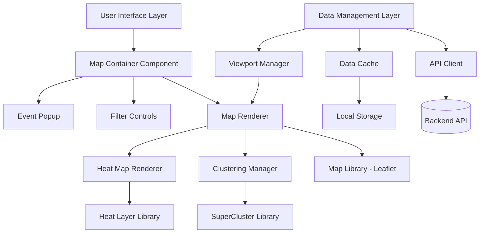

# Design Document: Map Visualization

## Overview

The Map Visualization feature implements a high-performance, responsive web application for displaying road surface anomalies on an interactive map. The system prioritizes spatial exploration of road conditions with efficient handling of large datasets through clustering, virtualization, and progressive loading techniques. The architecture emphasizes user experience with smooth interactions, accessibility compliance, and multi-device support while maintaining real-time performance with thousands of data points.

## Architecture

The system follows a component-based React architecture with clear separation between data management, visualization logic, and user interface:



### Key Architectural Decisions

1. **Leaflet with React**: Use React-Leaflet for component-based map integration with proven performance for large datasets
2. **SuperCluster**: Implement Mapbox SuperCluster for efficient point clustering with sub-linear performance
3. **Canvas Rendering**: Use Canvas-based rendering for heat maps and high-density visualizations
4. **Viewport-Based Loading**: Load and render only data within the current viewport plus buffer zone
5. **Progressive Enhancement**: Start with basic functionality and progressively add advanced features

## Components and Interfaces

### 1. MapContainer (Main Component)

**Responsibilities:**
- Coordinate all map-related components
- Manage application state and data flow
- Handle user interactions and routing

**Key Methods:**
```typescript
interface MapContainer {
  initializeMap(): void
  updateViewport(bounds: LatLngBounds): void
  applyFilters(filters: FilterCriteria): void
  toggleVisualizationMode(mode: 'markers' | 'heatmap'): void
  handleMarkerClick(eventId: string): void
}
```

### 2. MapRenderer

**Responsibilities:**
- Render the interactive map using Leaflet
- Manage map layers and overlays
- Handle zoom, pan, and viewport changes

**Key Methods:**
```typescript
interface MapRenderer {
  renderMap(container: HTMLElement): LeafletMap
  updateMarkers(events: RoadAnomalyEvent[]): void
  updateClusters(clusters: ClusterData[]): void
  setMapStyle(style: MapStyle): void
  centerOnLocation(lat: number, lng: number): void
  fitBounds(bounds: LatLngBounds): void
}
```

### 3. ClusteringManager

**Responsibilities:**
- Group nearby markers into clusters
- Calculate cluster statistics and appearance
- Handle cluster expansion and zoom behavior

**Key Methods:**
```typescript
interface ClusteringManager {
  generateClusters(events: RoadAnomalyEvent[], zoom: number): ClusterData[]
  getClusterBounds(cluster: ClusterData): LatLngBounds
  expandCluster(clusterId: string): void
  shouldCluster(zoomLevel: number, eventCount: number): boolean
}
```

### 4. HeatMapRenderer

**Responsibilities:**
- Generate heat map visualization from point data
- Manage heat map intensity and color gradients
- Handle heat map layer toggling

**Key Methods:**
```typescript
interface HeatMapRenderer {
  generateHeatMap(events: RoadAnomalyEvent[]): HeatMapLayer
  updateIntensity(intensity: number): void
  setColorGradient(gradient: ColorGradient): void
  toggleHeatMapVisibility(visible: boolean): void
}
```

### 5. FilterControls

**Responsibilities:**
- Provide user interface for data filtering
- Manage filter state and validation
- Communicate filter changes to parent components

**Key Methods:**
```typescript
interface FilterControls {
  renderFilterUI(): JSX.Element
  updateSeverityFilter(levels: number[]): void
  updateDateRangeFilter(start: Date, end: Date): void
  updateConfidenceFilter(threshold: number): void
  clearAllFilters(): void
  getActiveFilters(): FilterCriteria
}
```

### 6. EventPopup

**Responsibilities:**
- Display detailed information for selected events
- Handle popup positioning and responsive layout
- Manage popup lifecycle and interactions

**Key Methods:**
```typescript
interface EventPopup {
  showEventDetails(event: RoadAnomalyEvent, position: LatLng): void
  hidePopup(): void
  updatePosition(position: LatLng): void
  formatEventData(event: RoadAnomalyEvent): PopupContent
}
```

### 7. DataManager

**Responsibilities:**
- Fetch and cache road anomaly data
- Manage data synchronization and updates
- Handle offline scenarios and error states

**Key Methods:**
```typescript
interface DataManager {
  fetchEvents(bounds: LatLngBounds, filters: FilterCriteria): Promise<RoadAnomalyEvent[]>
  cacheEvents(events: RoadAnomalyEvent[]): void
  getCachedEvents(bounds: LatLngBounds): RoadAnomalyEvent[]
  subscribeToUpdates(callback: (events: RoadAnomalyEvent[]) => void): void
  clearCache(): void
}
```

## Data Models

### RoadAnomalyEvent
```typescript
interface RoadAnomalyEvent {
  id: string
  createdAt: Date
  latitude: number
  longitude: number
  gpsAccuracyM: number
  speedKmh: number
  headingDeg?: number
  peakAccelMs2: number
  impulseDurationMs: number
  severity: 1 | 2 | 3 | 4 | 5
  confidence: number // 0.0-1.0
  deviceModel: string
  androidVersion: string
  sessionId: string
}
```

### ClusterData
```typescript
interface ClusterData {
  id: string
  latitude: number
  longitude: number
  eventCount: number
  maxSeverity: number
  averageConfidence: number
  bounds: LatLngBounds
  events: RoadAnomalyEvent[]
}
```

### FilterCriteria
```typescript
interface FilterCriteria {
  severityLevels: number[]
  dateRange: {
    start: Date
    end: Date
  }
  confidenceThreshold: number
  bounds?: LatLngBounds
}
```

### ViewportState
```typescript
interface ViewportState {
  center: LatLng
  zoom: number
  bounds: LatLngBounds
  pixelBounds: PixelBounds
}
```

## Visualization Strategy

### Marker Clustering Algorithm
Based on research findings, the system implements SuperCluster for optimal performance:

```typescript
const clusterOptions = {
  radius: 60,        // Cluster radius in pixels
  maxZoom: 15,       // Max zoom to cluster points
  minZoom: 0,        // Min zoom to cluster points
  minPoints: 2,      // Minimum points to form cluster
  extent: 512,       // Tile extent
  nodeSize: 64       // Size of KD-tree leaf node
}
```

### Severity-Based Visual Coding
```typescript
const severityColors = {
  1: '#22c55e', // Green - Minor
  2: '#eab308', // Yellow - Moderate  
  3: '#f97316', // Orange - Significant
  4: '#ef4444', // Red - Major
  5: '#991b1b'  // Dark Red - Severe
}

const severityIcons = {
  1: 'circle-small',
  2: 'circle-medium',
  3: 'triangle',
  4: 'diamond',
  5: 'hexagon'
}
```

### Heat Map Configuration
```typescript
const heatMapOptions = {
  radius: 25,
  blur: 15,
  maxZoom: 12,
  gradient: {
    0.0: '#313695',  // Blue - Low density
    0.2: '#4575b4',
    0.4: '#74add1',
    0.6: '#abd9e9',
    0.8: '#fee090',
    1.0: '#d73027'   // Red - High density
  }
}
```

## Performance Optimization Strategy

### Data Virtualization
- **Viewport-Based Loading**: Only load events within current viewport + 20% buffer
- **Progressive Loading**: Load high-priority data first (high severity, recent events)
- **Lazy Clustering**: Generate clusters only when zoom level requires them
- **Memory Management**: Unload off-screen data after 5 minutes of inactivity

### Rendering Optimization
- **Canvas Rendering**: Use Canvas for heat maps and high-density visualizations (>1000 points)
- **SVG for Precision**: Use SVG for individual markers and interactive elements
- **Frame Rate Control**: Throttle updates to maintain 30+ FPS during animations
- **Debounced Updates**: Debounce filter and viewport changes by 300ms

### Caching Strategy
```typescript
interface CacheStrategy {
  // Browser cache for static assets
  staticCache: {
    duration: '1 hour',
    assets: ['map tiles', 'icons', 'styles']
  }
  
  // Memory cache for event data
  memoryCache: {
    maxSize: '50MB',
    evictionPolicy: 'LRU',
    ttl: '10 minutes'
  }
  
  // Local storage for user preferences
  localStorage: {
    filters: 'persistent',
    mapState: 'session',
    preferences: 'persistent'
  }
}
```

## Responsive Design Implementation

### Breakpoint Strategy
```typescript
const breakpoints = {
  mobile: '0-767px',
  tablet: '768-1023px', 
  desktop: '1024px+'
}

const responsiveConfig = {
  mobile: {
    clusterRadius: 40,
    popupMaxWidth: '90vw',
    controlsPosition: 'bottom',
    touchOptimized: true
  },
  tablet: {
    clusterRadius: 50,
    popupMaxWidth: '400px',
    controlsPosition: 'top-right',
    touchOptimized: true
  },
  desktop: {
    clusterRadius: 60,
    popupMaxWidth: '500px',
    controlsPosition: 'top-right',
    touchOptimized: false
  }
}
```

### Touch Interaction Optimization
- **Gesture Recognition**: Support pinch-to-zoom, drag-to-pan, double-tap-to-zoom
- **Touch Targets**: Minimum 44px touch targets for accessibility
- **Momentum Scrolling**: Smooth momentum-based panning on mobile
- **Haptic Feedback**: Subtle vibration feedback for touch interactions (where supported)

## Accessibility Implementation

### WCAG 2.1 AA Compliance
```typescript
const accessibilityFeatures = {
  // Keyboard navigation
  keyboardSupport: {
    tabNavigation: true,
    arrowKeyPanning: true,
    enterToActivate: true,
    escapeToClose: true
  },
  
  // Screen reader support
  screenReader: {
    ariaLabels: true,
    roleAttributes: true,
    liveRegions: true,
    altText: true
  },
  
  // Visual accessibility
  visualAccess: {
    colorContrast: '4.5:1 minimum',
    focusIndicators: 'visible',
    alternativeIndicators: true, // shapes for color-blind users
    textScaling: 'up to 200%'
  }
}
```

### Alternative Visual Indicators
For color-blind accessibility, severity levels use both color and shape:
- **Level 1**: Green circle
- **Level 2**: Yellow square
- **Level 3**: Orange triangle
- **Level 4**: Red diamond
- **Level 5**: Dark red hexagon

Now I need to use the prework tool to analyze the acceptance criteria before writing the correctness properties.
## Correctness Properties

*A property is a characteristic or behavior that should hold true across all valid executions of a system—essentially, a formal statement about what the system should do. Properties serve as the bridge between human-readable specifications and machine-verifiable correctness guarantees.*

### Property 1: Interactive Map Operations Support
*For any* user interaction with the map (pan, zoom, rotation), the map renderer should respond appropriately and maintain smooth performance across all zoom levels from 1 to 18.
**Validates: Requirements 1.2, 1.3**

### Property 2: Viewport Update Performance
*For any* map viewport change, the display should update within 200 milliseconds to maintain responsive user experience.
**Validates: Requirements 1.4**

### Property 3: Location-Based Centering Availability
*For any* scenario where user location is available, the map renderer should provide an option to center the map on the user's current position.
**Validates: Requirements 1.5**

### Property 4: Anomaly Marker Display Completeness
*For any* set of road anomaly data provided to the map, each event should be displayed as a marker positioned at the exact GPS coordinates of the detected event.
**Validates: Requirements 2.1, 2.2**

### Property 5: Zoom-Based Marker Visibility
*For any* area with multiple anomalies, individual markers should be visible when zoomed in sufficiently, regardless of clustering at lower zoom levels.
**Validates: Requirements 2.3**

### Property 6: Clustering Threshold Behavior
*For any* map viewport containing more than 100 visible anomalies, nearby markers should be grouped into clusters to maintain performance and usability.
**Validates: Requirements 2.4**

### Property 7: Cluster Interaction Expansion
*For any* event cluster that is clicked, the map should zoom in to reveal the individual anomaly markers contained within that cluster.
**Validates: Requirements 2.5**

### Property 8: Comprehensive Severity Color Coding
*For any* anomaly marker displayed, the severity indicator should use the correct distinct color for each severity level: level 1 → green, level 2 → yellow, level 3 → orange, level 4 → red, level 5 → dark red.
**Validates: Requirements 3.1, 3.2, 3.3, 3.4, 3.5, 3.6**

### Property 9: Cluster Severity Display
*For any* clustered events, the severity indicator should display the highest severity level present among all events in the cluster.
**Validates: Requirements 3.7**

### Property 10: Event Popup Activation
*For any* anomaly marker that is clicked, an event popup should display with detailed information about the selected event.
**Validates: Requirements 4.1**

### Property 11: Complete Event Information Display
*For any* event popup displayed, all required information should be included: detection timestamp, severity level, confidence score, GPS coordinates, location accuracy, peak acceleration value, impulse duration, device information, and session context.
**Validates: Requirements 4.2, 4.3, 4.4, 4.5**

### Property 12: Popup Dismissal Behavior
*For any* open event popup, it should close automatically when the user clicks outside the popup or presses the escape key.
**Validates: Requirements 4.6**

### Property 13: Initial Load Performance
*For any* initial map load on standard broadband connections, the interface should display within 3 seconds.
**Validates: Requirements 5.1**

### Property 14: Large Dataset Virtualization
*For any* viewport containing more than 1000 anomalies, data virtualization should be implemented to maintain performance.
**Validates: Requirements 5.2**

### Property 15: Animation Frame Rate Maintenance
*For any* zoom or pan operation, the map should maintain frame rates above 30 FPS during animations.
**Validates: Requirements 5.3**

### Property 16: Loading Indicator Display
*For any* data loading operation taking longer than 500 milliseconds, appropriate loading indicators should be displayed to the user.
**Validates: Requirements 5.4**

### Property 17: Viewport-Priority Data Loading
*For any* slow network connectivity scenario, anomalies in the current viewport should be prioritized for loading before off-screen data.
**Validates: Requirements 5.5**

### Property 18: Mobile Interface Adaptation
*For any* access on mobile devices, the interface should adapt for touch interactions and optimize layout when screen width is less than 768 pixels.
**Validates: Requirements 6.1, 6.2**

### Property 19: Touch Gesture Support
*For any* touch-enabled device, the map should support pinch-to-zoom and drag-to-pan operations.
**Validates: Requirements 6.3**

### Property 20: Mobile Popup Responsive Sizing
*For any* event popup displayed on mobile devices, it should size appropriately for the screen dimensions.
**Validates: Requirements 6.4**

### Property 21: Orientation Change Responsiveness
*For any* device orientation change, the map layout should adjust within 300 milliseconds.
**Validates: Requirements 6.5**

### Property 22: Comprehensive Filter Controls Availability
*For any* map interface with filtering enabled, filter options should be available for severity level (1-5), date range, and confidence score threshold.
**Validates: Requirements 7.1, 7.2, 7.3**

### Property 23: Filter Application Performance
*For any* filter changes applied, the displayed anomalies should update within 500 milliseconds.
**Validates: Requirements 7.4**

### Property 24: Filter Clearing Restoration
*For any* active filters that are cleared, the full dataset display should be restored.
**Validates: Requirements 7.5**

### Property 25: Multiple Filter Logic
*For any* combination of multiple active filters, all filters should be applied simultaneously using AND logic, showing only events that match all criteria.
**Validates: Requirements 7.6**

### Property 26: Heat Map Density Visualization
*For any* heat map mode activation, anomaly density should be displayed using color intensity gradients with blue indicating low density and red indicating high density.
**Validates: Requirements 8.1, 8.2**

### Property 27: Automatic Visualization Mode Switching
*For any* zoom level change, the system should automatically switch to heat map visualization when zoom level is below 12, and switch to individual marker display when zoom level is 12 or above.
**Validates: Requirements 8.3, 8.4**

### Property 28: Heat Map Viewport Updates
*For any* viewport change while heat map is active, density calculations should update to reflect the new visible area.
**Validates: Requirements 8.5**

### Property 29: Heat Map Processing Indicators
*For any* heat map calculation processing, appropriate loading indicators should be displayed during computation.
**Validates: Requirements 8.6**

### Property 30: Map Layer Options and Visibility
*For any* map layer controls, at least street map and satellite imagery options should be available, with anomaly markers maintaining sufficient contrast for visibility on both layer types.
**Validates: Requirements 9.1, 9.3, 9.4**

### Property 31: Layer Switching Viewport Persistence
*For any* map layer switch, the current viewport position and zoom level should be maintained throughout the transition.
**Validates: Requirements 9.2**

### Property 32: Layer Transition Performance
*For any* layer switching operation, the transition should complete within 2 seconds.
**Validates: Requirements 9.5**

### Property 33: Keyboard Navigation Accessibility
*For any* keyboard navigation usage, tab navigation should work through all interactive elements, and focused anomaly markers should provide keyboard shortcuts to open event details.
**Validates: Requirements 10.1, 10.3**

### Property 34: Screen Reader Accessibility
*For any* screen reader usage, appropriate ARIA labels and descriptions should be provided for all map elements.
**Validates: Requirements 10.2**

### Property 35: Color-Blind Accessibility
*For any* severity color coding, alternative visual indicators (shapes, patterns) should be provided in addition to colors for color-blind users.
**Validates: Requirements 10.4**

### Property 36: Text Contrast Accessibility
*For any* text information displayed, sufficient color contrast ratios (4.5:1 minimum) should be maintained for readability.
**Validates: Requirements 10.5**

## Error Handling

### Data Loading Failures
- **API Unavailable**: Display cached data with offline indicator, retry with exponential backoff
- **Network Timeout**: Show timeout message, provide manual retry option
- **Invalid Data Format**: Log error, filter out invalid records, display warning to user
- **Empty Dataset**: Display "No data available" message with refresh option

### Map Rendering Failures
- **Map Tiles Failed**: Fallback to alternative tile provider, display connection error
- **Clustering Library Error**: Fallback to simple marker display, log error for debugging
- **Heat Map Generation Failed**: Switch to marker mode, display error notification
- **Memory Exhaustion**: Implement data pagination, reduce visible markers

### User Interaction Errors
- **Geolocation Denied**: Disable location centering, show permission request
- **Touch Gesture Conflicts**: Implement gesture disambiguation, prioritize map interactions
- **Popup Positioning Errors**: Implement smart positioning to keep popups in viewport
- **Filter Validation Errors**: Display validation messages, reset to valid state

### Performance Degradation
- **Low Frame Rate**: Reduce marker density, disable animations temporarily
- **Memory Leaks**: Implement cleanup routines, restart components if necessary
- **Slow Clustering**: Increase cluster radius, reduce precision temporarily
- **Browser Compatibility**: Provide graceful degradation for unsupported features

## Testing Strategy

### Dual Testing Approach
The system requires both unit testing and property-based testing to ensure comprehensive coverage:

**Unit Tests** focus on:
- Specific component behaviors and edge cases
- User interaction scenarios and event handling
- Error conditions and recovery mechanisms
- Integration between React components and map libraries

**Property-Based Tests** focus on:
- Universal properties that hold across all data inputs
- Performance characteristics under various load conditions
- Correctness properties defined in this design document
- Cross-browser and cross-device compatibility

### Property-Based Testing Configuration
- **Testing Framework**: Use fast-check for JavaScript property-based testing
- **Test Iterations**: Minimum 100 iterations per property test
- **Test Tagging**: Each property test must reference its design document property
- **Tag Format**: `**Feature: map-visualization, Property {number}: {property_text}**`

### Unit Testing Balance
- Focus unit tests on specific user scenarios and component integration
- Avoid excessive unit testing of behaviors covered by property tests
- Emphasize testing of:
  - React component lifecycle and state management
  - Map library integration and event handling
  - Responsive design breakpoints and layout changes
  - Accessibility features and keyboard navigation

### Test Data Generation
Property tests should use intelligent generators that:
- Generate realistic road anomaly datasets with various distributions
- Simulate different viewport sizes and zoom levels
- Create diverse user interaction patterns and sequences
- Test across different device capabilities and network conditions
- Include edge cases like empty datasets, extreme coordinates, and invalid data

### Performance Testing
- **Load Testing**: Test with datasets of 1K, 10K, 100K+ markers
- **Stress Testing**: Rapid zoom/pan operations, filter changes, layer switches
- **Memory Testing**: Long-running sessions, memory leak detection
- **Network Testing**: Various connection speeds, intermittent connectivity
- **Device Testing**: Low-end mobile devices, high-DPI displays, touch interfaces

The combination of unit and property-based tests ensures both specific correctness and general system reliability across the wide range of real-world conditions the map visualization system will encounter.